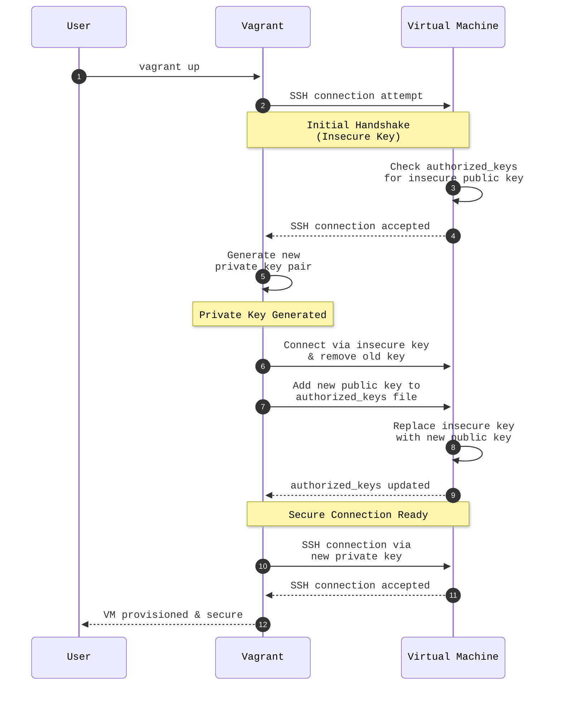

# Vagrant Initial Handshake

When `vagrant up` is first run, Vagrant bootstraps a secure SSH connection to the VM through a two-phase key exchange. It starts with an insecure default key shipped with the box, immediately replaces it with a freshly generated key pair, and from that point on all communication uses the new secure key.

The diagram below illustrates this process for the `my-ubuntu-box` VM.

